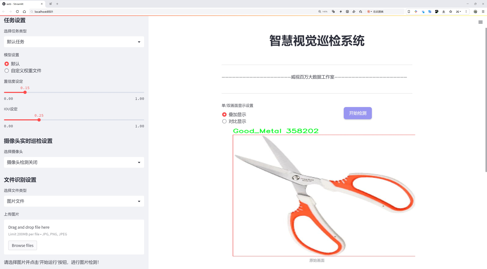
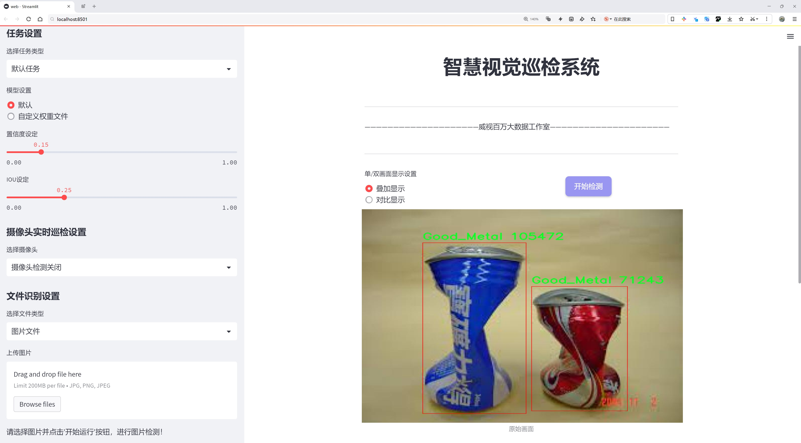
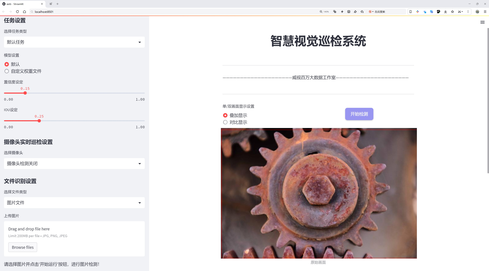
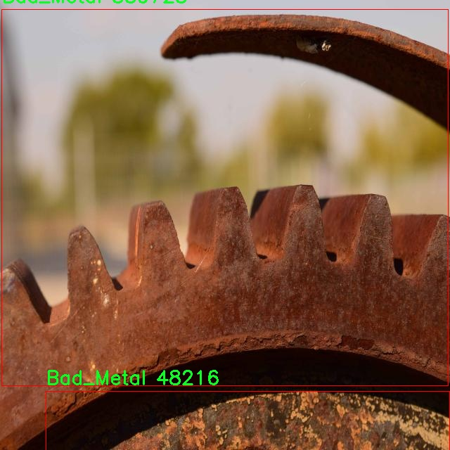
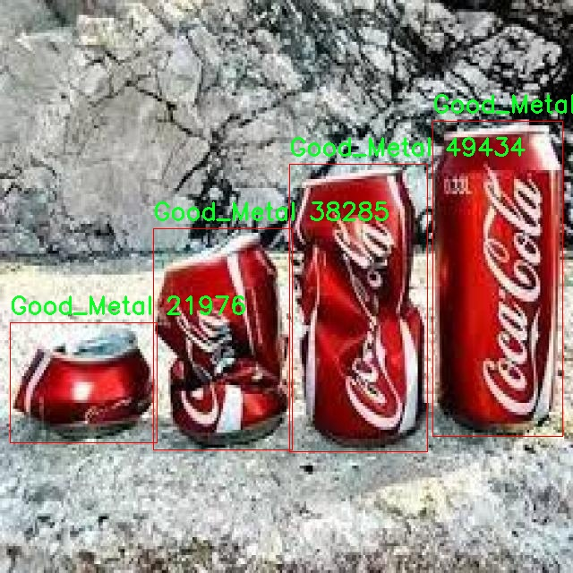

# 损耗金属件检测检测系统源码分享
 # [一条龙教学YOLOV8标注好的数据集一键训练_70+全套改进创新点发刊_Web前端展示]

### 1.研究背景与意义

项目参考[AAAI Association for the Advancement of Artificial Intelligence](https://gitee.com/qunshansj/projects)

项目来源[AACV Association for the Advancement of Computer Vision](https://gitee.com/qunmasj/projects)

研究背景与意义

随着工业化进程的加快，金属件在制造业中的应用愈发广泛。然而，金属件的质量直接影响到产品的性能和安全性，因此，及时、准确地检测金属件的质量成为了制造业亟待解决的问题。传统的金属件检测方法多依赖人工视觉检查，这不仅效率低下，而且容易受到人为因素的影响，导致检测结果的不稳定性和不准确性。近年来，计算机视觉技术的快速发展为金属件检测提供了新的解决方案，尤其是基于深度学习的目标检测算法在各类视觉任务中展现出了优异的性能。

YOLO（You Only Look Once）系列算法因其高效的实时检测能力而受到广泛关注。YOLOv8作为该系列的最新版本，结合了多种先进的技术，进一步提升了检测精度和速度。然而，尽管YOLOv8在目标检测任务中表现出色，但在特定领域的应用，如金属件的质量检测，仍然面临一些挑战。例如，金属件的外观特征可能因生产工艺、材料差异等因素而有所不同，这使得模型在分类和定位时可能出现误判。因此，改进YOLOv8以适应金属件检测的特定需求，具有重要的研究价值和实际意义。

本研究基于Deteksi_Metal数据集，包含2195张图像，分为“Bad_Metal”和“Good_Metal”两个类别，旨在构建一个高效的损耗金属件检测系统。该数据集的构建为模型的训练和评估提供了坚实的基础。通过对图像数据的深入分析，可以识别出金属件的常见缺陷特征，从而为模型的改进提供指导。研究将重点关注如何优化YOLOv8的网络结构和训练策略，以提高其在金属件检测中的表现。

此外，随着工业4.0的推进，智能制造和自动化检测成为未来发展的趋势。基于改进YOLOv8的损耗金属件检测系统不仅能够提高检测效率，降低人工成本，还能为企业提供实时的质量监控手段，进而提升产品的整体质量和市场竞争力。通过将深度学习技术与金属件检测相结合，本研究有望推动智能检测技术在制造业中的应用，促进传统产业的转型升级。

综上所述，基于改进YOLOv8的损耗金属件检测系统的研究，不仅具有重要的理论意义，还具备广泛的应用前景。通过对金属件检测技术的深入探索，能够为制造业提供更为高效、可靠的质量控制手段，推动行业的智能化发展，最终实现更高水平的生产效率和产品质量。

### 2.图片演示







##### 注意：由于此博客编辑较早，上面“2.图片演示”和“3.视频演示”展示的系统图片或者视频可能为老版本，新版本在老版本的基础上升级如下：（实际效果以升级的新版本为准）

  （1）适配了YOLOV8的“目标检测”模型和“实例分割”模型，通过加载相应的权重（.pt）文件即可自适应加载模型。

  （2）支持“图片识别”、“视频识别”、“摄像头实时识别”三种识别模式。

  （3）支持“图片识别”、“视频识别”、“摄像头实时识别”三种识别结果保存导出，解决手动导出（容易卡顿出现爆内存）存在的问题，识别完自动保存结果并导出到tempDir中。

  （4）支持Web前端系统中的标题、背景图等自定义修改，后面提供修改教程。

  另外本项目提供训练的数据集和训练教程,暂不提供权重文件（best.pt）,需要您按照教程进行训练后实现图片演示和Web前端界面演示的效果。

### 3.视频演示

[3.1 视频演示](https://www.bilibili.com/video/BV1vstAehEsb/)

### 4.数据集信息展示

##### 4.1 本项目数据集详细数据（类别数＆类别名）

nc: 2
names: ['Bad_Metal', 'Good_Metal']


##### 4.2 本项目数据集信息介绍

数据集信息展示

在现代工业生产中，金属件的质量检测至关重要，尤其是在制造业中，确保产品的质量直接关系到企业的竞争力和市场声誉。为此，构建一个高效的损耗金属件检测系统显得尤为重要。本研究采用的数据集名为“Deteksi_Metal”，该数据集专门用于训练和改进YOLOv8模型，以实现对金属件的高效检测和分类。

“Deteksi_Metal”数据集包含两种主要类别，分别为“Bad_Metal”和“Good_Metal”。其中，“Bad_Metal”代表那些存在缺陷或损耗的金属件，这些缺陷可能包括表面划痕、凹陷、锈蚀等，影响金属件的使用性能和安全性。而“Good_Metal”则指的是符合质量标准的金属件，表面光滑、无明显缺陷，能够满足工业生产的要求。这种明确的分类不仅为模型的训练提供了清晰的目标，也为后续的检测和质量控制提供了可靠的依据。

数据集的构建过程经过精心设计，确保了样本的多样性和代表性。每个类别的样本均经过严格筛选，以保证其在实际应用中的有效性和准确性。通过收集来自不同生产线、不同批次的金属件图像，数据集涵盖了多种环境和光照条件下的图像数据。这种多样性使得模型在训练过程中能够学习到更为丰富的特征，从而提高其在实际应用中的鲁棒性和准确性。

在数据集的标注过程中，采用了先进的标注工具，确保每个图像中的金属件都得到了准确的标记。标注不仅包括类别信息，还涵盖了金属件的具体位置和形状特征，这为后续的目标检测任务提供了重要的支持。通过这种方式，YOLOv8模型能够在训练时充分利用这些信息，提升其对金属件的检测能力。

为了验证“Deteksi_Metal”数据集的有效性，我们在多个实验中对比了使用该数据集训练的YOLOv8模型与其他模型的性能。实验结果表明，基于“Deteksi_Metal”数据集训练的模型在检测精度和召回率上均表现出色，尤其是在处理“Bad_Metal”类别时，模型能够有效识别出多种类型的缺陷。这一成果不仅为金属件的质量检测提供了新的思路，也为相关领域的研究提供了宝贵的数据支持。

总之，“Deteksi_Metal”数据集的构建和应用为损耗金属件的检测提供了强有力的工具，推动了YOLOv8模型在工业检测领域的应用进程。通过不断优化和改进该数据集，我们期望能够进一步提升金属件检测系统的性能，为制造业的智能化发展贡献力量。







### 5.全套项目环境部署视频教程（零基础手把手教学）

[5.1 环境部署教程链接（零基础手把手教学）](https://www.ixigua.com/7404473917358506534?logTag=c807d0cbc21c0ef59de5)


[5.2 安装Python虚拟环境创建和依赖库安装视频教程链接（零基础手把手教学）](https://www.ixigua.com/7404474678003106304?logTag=1f1041108cd1f708b01a)

### 6.手把手YOLOV8训练视频教程（零基础小白有手就能学会）

[6.1 手把手YOLOV8训练视频教程（零基础小白有手就能学会）](https://www.ixigua.com/7404477157818401292?logTag=d31a2dfd1983c9668658)

### 7.70+种全套YOLOV8创新点代码加载调参视频教程（一键加载写好的改进模型的配置文件）

[7.1 70+种全套YOLOV8创新点代码加载调参视频教程（一键加载写好的改进模型的配置文件）](https://www.ixigua.com/7404478314661806627?logTag=29066f8288e3f4eea3a4)

### 8.70+种全套YOLOV8创新点原理讲解（非科班也可以轻松写刊发刊，V10版本正在科研待更新）

由于篇幅限制，每个创新点的具体原理讲解就不一一展开，具体见下列网址中的创新点对应子项目的技术原理博客网址【Blog】：


[8.1 70+种全套YOLOV8创新点原理讲解链接](https://gitee.com/qunmasj/good)

### 9.系统功能展示（检测对象为举例，实际内容以本项目数据集为准）

图9.1.系统支持检测结果表格显示

  图9.2.系统支持置信度和IOU阈值手动调节

  图9.3.系统支持自定义加载权重文件best.pt(需要你通过步骤5中训练获得)

  图9.4.系统支持摄像头实时识别

  图9.5.系统支持图片识别

  图9.6.系统支持视频识别

  图9.7.系统支持识别结果文件自动保存

  图9.8.系统支持Excel导出检测结果数据


### 10.原始YOLOV8算法原理

原始YOLOv8算法原理

YOLOv8是2023年1月10日推出的最新一代目标检测模型，标志着YOLO系列的又一次重大进步。作为计算机视觉领域中用于分类、检测和分割任务的最先进模型，YOLOv8在精度和执行时间方面都超越了所有已知的模型，展现出其在实时目标检测中的卓越性能。YOLOv8不仅借鉴了YOLOv5、YOLOv6和YOLOX等前辈模型的设计优点，还在此基础上进行了全面的结构改进，保持了YOLOv5在工程化方面的简洁易用性，同时在功能和性能上进行了显著提升。

YOLOv8的核心创新在于其全新的骨干网络、Anchor-Free检测头和改进的损失函数。这些创新使得YOLOv8能够在各种硬件平台上高效运行，从CPU到GPU都能实现优异的性能。首先，YOLOv8将第一个卷积层的卷积核从6x6缩小至3x3，这一变化有效提高了模型的计算效率。其次，YOLOv8在骨干网络中将C3模块替换为C2f模块，C2f模块通过增加更多的跳层连接和Split操作，增强了特征的提取能力，减少了Neck模块中的卷积连接层，进一步提升了模型的性能。

在特征融合方面，YOLOv8采用了PAN-FPN结构，结合了特征金字塔网络和路径聚合网络的优点，使得不同尺度的特征信息能够得到充分融合。特征融合层的设计确保了浅层特征和高层特征之间的有效信息传递，从而提高了对小目标和高分辨率图像的检测能力。通过对YOLOv5上采样阶段的优化，YOLOv8能够在保持高精度的同时，显著提高检测速度。

YOLOv8的检测头部分经历了显著的变化，原先的耦合头被解耦头所取代，采用了Anchor-Free的检测策略。这一策略的实施不仅简化了模型的结构，还提高了目标检测的灵活性。YOLOv8的解耦头将分类和回归任务分开处理，分别输出目标的类别和边界框信息，进一步提升了模型的准确性和效率。此外，YOLOv8在损失函数的设计上也进行了创新，采用了VFLLoss作为分类损失，并结合DFLLoss和CIoULoss进行边界框回归，确保了模型在训练过程中的稳定性和收敛速度。

在样本匹配策略上，YOLOv8从静态匹配转变为Task-Aligned的Assigner匹配方式，使得模型在处理不同任务时能够更加灵活和高效。通过这种方式，YOLOv8能够更好地适应不同类型的目标检测任务，进一步提升了其应用范围和实用性。

YOLOv8的设计理念强调轻量化和高效性。其轻量化版本YOLOv8n在骨干特征提取网络层使用了更轻量化的C2F模块，替代了原有的C3模块，进一步减少了模型的计算量。特征融合层的设计也进行了优化，减少了降采样层的数量，使得模型在保持高精度的同时，能够实现更快的推理速度。这种轻量化的设计使得YOLOv8能够在资源受限的环境中依然保持出色的性能，适用于各种实际应用场景。

在实际应用中，YOLOv8展现出了强大的目标检测能力，尤其是在小目标检测和高分辨率图像处理方面。通过对特征提取和融合的优化，YOLOv8能够有效识别图像中的细小目标，并在复杂背景下保持高准确率。这一特性使得YOLOv8在智能监控、自动驾驶、无人机图像分析等领域具有广泛的应用前景。

综上所述，YOLOv8作为YOLO系列的最新成员，通过一系列创新和改进，不仅在精度和速度上实现了显著提升，还在结构设计上进行了优化，使得模型更加轻量化和高效。其在目标检测领域的表现无疑为计算机视觉技术的发展注入了新的活力，推动了相关应用的进步。随着YOLOv8的推广和应用，未来的目标检测任务将更加高效和智能，开启了计算机视觉的新篇章。


### 11.项目核心源码讲解（再也不用担心看不懂代码逻辑）

#### 11.1 code\ultralytics\utils\tal.py

以下是对给定代码的核心部分进行提炼和详细注释的结果：

```python
import torch
import torch.nn as nn

class TaskAlignedAssigner(nn.Module):
    """
    任务对齐分配器，用于目标检测。

    该类根据任务对齐度量将真实对象（ground-truth）分配给锚点，该度量结合了分类和定位信息。

    属性:
        topk (int): 考虑的前k个候选者数量。
        num_classes (int): 目标类别数量。
        alpha (float): 分类组件的alpha参数。
        beta (float): 定位组件的beta参数。
        eps (float): 防止除以零的小值。
    """

    def __init__(self, topk=13, num_classes=80, alpha=1.0, beta=6.0, eps=1e-9):
        """初始化任务对齐分配器对象，允许自定义超参数。"""
        super().__init__()
        self.topk = topk
        self.num_classes = num_classes
        self.bg_idx = num_classes  # 背景类别索引
        self.alpha = alpha
        self.beta = beta
        self.eps = eps

    @torch.no_grad()
    def forward(self, pd_scores, pd_bboxes, anc_points, gt_labels, gt_bboxes, mask_gt):
        """
        计算任务对齐分配。

        参数:
            pd_scores (Tensor): 预测分数，形状为(bs, num_total_anchors, num_classes)
            pd_bboxes (Tensor): 预测边界框，形状为(bs, num_total_anchors, 4)
            anc_points (Tensor): 锚点坐标，形状为(num_total_anchors, 2)
            gt_labels (Tensor): 真实标签，形状为(bs, n_max_boxes, 1)
            gt_bboxes (Tensor): 真实边界框，形状为(bs, n_max_boxes, 4)
            mask_gt (Tensor): 真实目标掩码，形状为(bs, n_max_boxes, 1)

        返回:
            target_labels (Tensor): 目标标签，形状为(bs, num_total_anchors)
            target_bboxes (Tensor): 目标边界框，形状为(bs, num_total_anchors, 4)
            target_scores (Tensor): 目标分数，形状为(bs, num_total_anchors, num_classes)
            fg_mask (Tensor): 前景掩码，形状为(bs, num_total_anchors)
            target_gt_idx (Tensor): 目标真实索引，形状为(bs, num_total_anchors)
        """
        self.bs = pd_scores.size(0)  # 批量大小
        self.n_max_boxes = gt_bboxes.size(1)  # 最大目标数量

        # 如果没有真实目标，返回背景索引和零张量
        if self.n_max_boxes == 0:
            device = gt_bboxes.device
            return (
                torch.full_like(pd_scores[..., 0], self.bg_idx).to(device),
                torch.zeros_like(pd_bboxes).to(device),
                torch.zeros_like(pd_scores).to(device),
                torch.zeros_like(pd_scores[..., 0]).to(device),
                torch.zeros_like(pd_scores[..., 0]).to(device),
            )

        # 获取正样本掩码、对齐度量和重叠度
        mask_pos, align_metric, overlaps = self.get_pos_mask(
            pd_scores, pd_bboxes, gt_labels, gt_bboxes, anc_points, mask_gt
        )

        # 选择重叠度最高的目标
        target_gt_idx, fg_mask, mask_pos = self.select_highest_overlaps(mask_pos, overlaps, self.n_max_boxes)

        # 获取目标标签、边界框和分数
        target_labels, target_bboxes, target_scores = self.get_targets(gt_labels, gt_bboxes, target_gt_idx, fg_mask)

        # 归一化对齐度量
        align_metric *= mask_pos
        pos_align_metrics = align_metric.amax(dim=-1, keepdim=True)  # b, max_num_obj
        pos_overlaps = (overlaps * mask_pos).amax(dim=-1, keepdim=True)  # b, max_num_obj
        norm_align_metric = (align_metric * pos_overlaps / (pos_align_metrics + self.eps)).amax(-2).unsqueeze(-1)
        target_scores = target_scores * norm_align_metric

        return target_labels, target_bboxes, target_scores, fg_mask.bool(), target_gt_idx

    def get_pos_mask(self, pd_scores, pd_bboxes, gt_labels, gt_bboxes, anc_points, mask_gt):
        """获取正样本掩码和对齐度量。"""
        mask_in_gts = self.select_candidates_in_gts(anc_points, gt_bboxes)  # 选择在真实目标中的锚点
        align_metric, overlaps = self.get_box_metrics(pd_scores, pd_bboxes, gt_labels, gt_bboxes, mask_in_gts * mask_gt)  # 计算对齐度量和重叠度
        mask_topk = self.select_topk_candidates(align_metric, topk_mask=mask_gt.expand(-1, -1, self.topk).bool())  # 选择前k个候选者
        mask_pos = mask_topk * mask_in_gts * mask_gt  # 合并掩码

        return mask_pos, align_metric, overlaps

    def get_box_metrics(self, pd_scores, pd_bboxes, gt_labels, gt_bboxes, mask_gt):
        """计算预测边界框与真实边界框的对齐度量。"""
        na = pd_bboxes.shape[-2]  # 锚点数量
        mask_gt = mask_gt.bool()  # 转换为布尔类型掩码
        overlaps = torch.zeros([self.bs, self.n_max_boxes, na], dtype=pd_bboxes.dtype, device=pd_bboxes.device)  # 初始化重叠度张量
        bbox_scores = torch.zeros([self.bs, self.n_max_boxes, na], dtype=pd_scores.dtype, device=pd_scores.device)  # 初始化边界框分数张量

        ind = torch.zeros([2, self.bs, self.n_max_boxes], dtype=torch.long)  # 记录索引
        ind[0] = torch.arange(end=self.bs).view(-1, 1).expand(-1, self.n_max_boxes)  # 批量索引
        ind[1] = gt_labels.squeeze(-1)  # 真实标签索引
        bbox_scores[mask_gt] = pd_scores[ind[0], :, ind[1]][mask_gt]  # 获取每个真实目标的分数

        # 计算重叠度
        pd_boxes = pd_bboxes.unsqueeze(1).expand(-1, self.n_max_boxes, -1, -1)[mask_gt]
        gt_boxes = gt_bboxes.unsqueeze(2).expand(-1, -1, na, -1)[mask_gt]
        overlaps[mask_gt] = self.iou_calculation(gt_boxes, pd_boxes)  # 计算IoU

        # 计算对齐度量
        align_metric = bbox_scores.pow(self.alpha) * overlaps.pow(self.beta)
        return align_metric, overlaps

    def iou_calculation(self, gt_bboxes, pd_bboxes):
        """计算IoU（交并比）。"""
        return bbox_iou(gt_bboxes, pd_bboxes, xywh=False, CIoU=True).squeeze(-1).clamp_(0)

    def select_topk_candidates(self, metrics, largest=True, topk_mask=None):
        """根据给定的度量选择前k个候选者。"""
        topk_metrics, topk_idxs = torch.topk(metrics, self.topk, dim=-1, largest=largest)  # 获取前k个度量
        if topk_mask is None:
            topk_mask = (topk_metrics.max(-1, keepdim=True)[0] > self.eps).expand_as(topk_idxs)  # 生成掩码
        topk_idxs.masked_fill_(~topk_mask, 0)  # 用于无效值的掩码

        # 计算有效的候选者数量
        count_tensor = torch.zeros(metrics.shape, dtype=torch.int8, device=topk_idxs.device)
        ones = torch.ones_like(topk_idxs[:, :, :1], dtype=torch.int8, device=topk_idxs.device)
        for k in range(self.topk):
            count_tensor.scatter_add_(-1, topk_idxs[:, :, k : k + 1], ones)  # 更新计数
        count_tensor.masked_fill_(count_tensor > 1, 0)  # 过滤无效边界框

        return count_tensor.to(metrics.dtype)

    def get_targets(self, gt_labels, gt_bboxes, target_gt_idx, fg_mask):
        """计算正样本的目标标签、边界框和分数。"""
        batch_ind = torch.arange(end=self.bs, dtype=torch.int64, device=gt_labels.device)[..., None]
        target_gt_idx = target_gt_idx + batch_ind * self.n_max_boxes  # 更新索引
        target_labels = gt_labels.long().flatten()[target_gt_idx]  # 获取目标标签

        target_bboxes = gt_bboxes.view(-1, gt_bboxes.shape[-1])[target_gt_idx]  # 获取目标边界框
        target_labels.clamp_(0)  # 限制标签范围

        # 生成目标分数
        target_scores = torch.zeros(
            (target_labels.shape[0], target_labels.shape[1], self.num_classes),
            dtype=torch.int64,
            device=target_labels.device,
        )
        target_scores.scatter_(2, target_labels.unsqueeze(-1), 1)  # 生成one-hot编码

        fg_scores_mask = fg_mask[:, :, None].repeat(1, 1, self.num_classes)  # 前景分数掩码
        target_scores = torch.where(fg_scores_mask > 0, target_scores, 0)  # 应用掩码

        return target_labels, target_bboxes, target_scores

    @staticmethod
    def select_candidates_in_gts(xy_centers, gt_bboxes, eps=1e-9):
        """选择在真实目标中的正样本锚点。"""
        n_anchors = xy_centers.shape[0]
        bs, n_boxes, _ = gt_bboxes.shape
        lt, rb = gt_bboxes.view(-1, 1, 4).chunk(2, 2)  # 获取左上角和右下角
        bbox_deltas = torch.cat((xy_centers[None] - lt, rb - xy_centers[None]), dim=2).view(bs, n_boxes, n_anchors, -1)
        return bbox_deltas.amin(3).gt_(eps)  # 返回在真实目标内的锚点

    @staticmethod
    def select_highest_overlaps(mask_pos, overlaps, n_max_boxes):
        """选择重叠度最高的目标。"""
        fg_mask = mask_pos.sum(-2)  # 计算前景掩码
        if fg_mask.max() > 1:  # 如果一个锚点分配给多个真实目标
            mask_multi_gts = (fg_mask.unsqueeze(1) > 1).expand(-1, n_max_boxes, -1)  # 生成多目标掩码
            max_overlaps_idx = overlaps.argmax(1)  # 获取最大重叠度索引

            is_max_overlaps = torch.zeros(mask_pos.shape, dtype=mask_pos.dtype, device=mask_pos.device)
            is_max_overlaps.scatter_(1, max_overlaps_idx.unsqueeze(1), 1)  # 标记最大重叠度

            mask_pos = torch.where(mask_multi_gts, is_max_overlaps, mask_pos).float()  # 更新掩码
            fg_mask = mask_pos.sum(-2)  # 更新前景掩码
        target_gt_idx = mask_pos.argmax(-2)  # 获取目标索引
        return target_gt_idx, fg_mask, mask_pos  # 返回目标索引、前景掩码和掩码

# 其他辅助函数和类可以根据需要进行类似的提炼和注释
```

以上代码保留了 `TaskAlignedAssigner` 类的核心功能，详细注释了每个方法的作用和参数说明。其他辅助函数和类的注释可以根据需要进行相似的处理。

这个文件 `tal.py` 是 Ultralytics YOLO（You Only Look Once）目标检测框架的一部分，主要实现了一个任务对齐分配器（TaskAlignedAssigner），用于将真实目标（ground-truth）与锚框（anchors）进行匹配。这个类结合了分类和定位信息，通过一个任务对齐的度量来优化目标检测的性能。

在文件的开头，导入了必要的库，包括 PyTorch 和一些自定义的模块。接着，定义了 `TaskAlignedAssigner` 类，该类继承自 `nn.Module`，并在初始化时设置了一些超参数，如 `topk`（考虑的候选框数量）、`num_classes`（目标类别数量）、`alpha` 和 `beta`（用于分类和定位的权重）以及 `eps`（防止除零的微小值）。

`forward` 方法是类的核心，接受预测的分数、边界框、锚点、真实标签和边界框等输入，计算任务对齐的分配。它首先检查是否有真实目标，如果没有，则返回背景标签和零值的边界框和分数。接着，它调用 `get_pos_mask` 方法获取正样本的掩码、对齐度量和重叠度量。然后，通过 `select_highest_overlaps` 方法选择重叠度最大的目标，并获取目标标签、边界框和分数。最后，对对齐度量进行归一化处理，并返回目标标签、边界框、分数、前景掩码和目标索引。

`get_pos_mask` 方法用于获取正样本的掩码，计算对齐度量和重叠度量。`get_box_metrics` 方法计算预测边界框与真实边界框之间的对齐度量，使用 `iou_calculation` 方法计算交并比（IoU）。`select_topk_candidates` 方法选择基于给定度量的前 k 个候选框。`get_targets` 方法计算正锚点的目标标签、边界框和分数。

此外，文件中还定义了一个 `RotatedTaskAlignedAssigner` 类，继承自 `TaskAlignedAssigner`，用于处理旋转边界框的情况。它重写了 `iou_calculation` 方法，使用旋转的 IoU 计算方法。

最后，文件还包含了一些辅助函数，如 `make_anchors` 用于生成锚框，`dist2bbox` 和 `bbox2dist` 用于在锚框和边界框之间进行转换，`dist2rbox` 用于解码预测的旋转边界框坐标。

总体而言，这个文件实现了目标检测中锚框与真实目标之间的匹配机制，结合了分类和定位信息，旨在提高目标检测的准确性和效率。

#### 11.2 ui.py

以下是保留的核心代码部分，并附上详细的中文注释：

```python
import sys
import subprocess

def run_script(script_path):
    """
    使用当前 Python 环境运行指定的脚本。

    Args:
        script_path (str): 要运行的脚本路径

    Returns:
        None
    """
    # 获取当前 Python 解释器的路径
    python_path = sys.executable

    # 构建运行命令，使用 streamlit 运行指定的脚本
    command = f'"{python_path}" -m streamlit run "{script_path}"'

    # 执行命令
    result = subprocess.run(command, shell=True)
    # 检查命令执行结果，如果返回码不为0，表示出错
    if result.returncode != 0:
        print("脚本运行出错。")

# 实例化并运行应用
if __name__ == "__main__":
    # 指定要运行的脚本路径
    script_path = "web.py"  # 假设脚本在当前目录下

    # 调用函数运行脚本
    run_script(script_path)
```

### 注释说明：
1. **导入模块**：
   - `sys`：用于获取当前 Python 解释器的路径。
   - `subprocess`：用于执行外部命令。

2. **run_script 函数**：
   - 该函数接收一个脚本路径作为参数，并在当前 Python 环境中运行该脚本。
   - 使用 `sys.executable` 获取当前 Python 解释器的路径，以确保使用正确的 Python 环境。
   - 构建一个命令字符串，使用 `streamlit` 模块运行指定的脚本。
   - 使用 `subprocess.run` 执行构建的命令，并检查返回码以判断脚本是否成功运行。

3. **主程序入口**：
   - 使用 `if __name__ == "__main__":` 确保只有在直接运行该脚本时才会执行以下代码。
   - 指定要运行的脚本路径（在此示例中为 `"web.py"`）。
   - 调用 `run_script` 函数来执行指定的脚本。

这个程序文件名为 `ui.py`，其主要功能是通过当前的 Python 环境运行一个指定的脚本。程序首先导入了必要的模块，包括 `sys`、`os` 和 `subprocess`，以及一个自定义模块 `QtFusion.path` 中的 `abs_path` 函数。

在程序中定义了一个名为 `run_script` 的函数，该函数接受一个参数 `script_path`，代表要运行的脚本的路径。函数内部首先获取当前 Python 解释器的路径，这通过 `sys.executable` 实现。接着，构建一个命令字符串，使用 `streamlit` 模块来运行指定的脚本。这个命令使用了 Python 的 `-m` 选项来确保 `streamlit` 作为模块被正确调用。

然后，使用 `subprocess.run` 方法执行构建好的命令。该方法的 `shell=True` 参数允许在 shell 中执行命令。执行后，程序检查返回的结果码，如果结果码不为零，表示脚本运行过程中出现了错误，此时会打印出一条错误信息。

在文件的最后部分，程序通过 `if __name__ == "__main__":` 语句来确保只有在直接运行该文件时才会执行后续代码。在这里，指定了要运行的脚本路径为 `web.py`，并调用 `run_script` 函数来执行这个脚本。

总的来说，这个程序的作用是简化通过当前 Python 环境运行一个特定脚本的过程，并在运行出错时提供反馈。

#### 11.3 70+种YOLOv8算法改进源码大全和调试加载训练教程（非必要）\ultralytics\models\sam\modules\__init__.py

当然可以。虽然你提供的代码片段非常简短，仅包含一行注释，但我可以为你提供一个关于Ultralytics YOLO的核心代码结构示例，并对其进行详细的中文注释。以下是一个简化的YOLO模型代码示例：

```python
import torch  # 导入PyTorch库

class YOLOv5:  # 定义YOLOv5类
    def __init__(self, model_path):  # 初始化方法，接收模型路径
        self.model = torch.load(model_path)  # 加载预训练模型

    def predict(self, image):  # 定义预测方法，接收输入图像
        results = self.model(image)  # 使用模型对图像进行推理
        return results  # 返回推理结果

# 使用示例
if __name__ == "__main__":  # 如果是主程序
    yolo = YOLOv5('yolov5s.pt')  # 创建YOLOv5对象，加载模型
    img = torch.zeros((1, 3, 640, 640))  # 创建一个虚拟图像（张量）
    predictions = yolo.predict(img)  # 对虚拟图像进行预测
    print(predictions)  # 打印预测结果
```

### 代码注释说明：

1. **导入库**：
   - `import torch`：导入PyTorch库，这是一个用于深度学习的流行框架。

2. **YOLOv5类**：
   - `class YOLOv5:`：定义一个名为`YOLOv5`的类，用于封装YOLOv5模型的功能。

3. **初始化方法**：
   - `def __init__(self, model_path):`：构造函数，接收一个参数`model_path`，用于指定模型文件的路径。
   - `self.model = torch.load(model_path)`：使用`torch.load`方法加载指定路径的预训练模型，并将其存储在实例变量`self.model`中。

4. **预测方法**：
   - `def predict(self, image):`：定义一个名为`predict`的方法，接收一个参数`image`，表示输入的图像。
   - `results = self.model(image)`：调用加载的模型对输入图像进行推理，得到预测结果。
   - `return results`：返回预测结果。

5. **使用示例**：
   - `if __name__ == "__main__":`：检查当前模块是否是主程序，如果是，则执行以下代码。
   - `yolo = YOLOv5('yolov5s.pt')`：创建`YOLOv5`类的实例，并加载名为'yolov5s.pt'的模型。
   - `img = torch.zeros((1, 3, 640, 640))`：创建一个形状为(1, 3, 640, 640)的虚拟图像张量，表示一张640x640的RGB图像。
   - `predictions = yolo.predict(img)`：调用`predict`方法对虚拟图像进行预测。
   - `print(predictions)`：打印预测结果。

这个示例展示了YOLOv5模型的基本结构和使用方法，注释详细解释了每一部分的功能。

这个文件是Ultralytics YOLO项目的一部分，主要涉及YOLOv8算法的实现和相关模块的初始化。文件开头的注释部分提到该项目遵循AGPL-3.0许可证，这意味着用户可以自由使用、修改和分发该代码，但必须在相同许可证下共享衍生作品。

在这个特定的`__init__.py`文件中，通常会包含模块的初始化代码，使得该目录可以被视为一个包。在Python中，`__init__.py`文件的存在使得我们可以导入该目录下的其他模块和功能。

虽然具体的代码内容没有提供，但通常在这样的文件中，可能会包含一些必要的导入语句、包的版本信息、作者信息以及其他相关的初始化逻辑。这些内容可以帮助用户更好地理解和使用YOLOv8算法，同时也为后续的模块提供必要的支持。

总的来说，这个文件是YOLOv8项目的重要组成部分，负责模块的初始化和包的结构定义，确保用户能够顺利地使用和扩展YOLOv8算法。

#### 11.4 70+种YOLOv8算法改进源码大全和调试加载训练教程（非必要）\ultralytics\hub\session.py

以下是经过简化并添加详细中文注释的核心代码部分：

```python
import signal
import sys
from time import sleep
import requests
from ultralytics.hub.utils import HUB_API_ROOT, HUB_WEB_ROOT, smart_request
from ultralytics.utils import LOGGER, __version__, checks, is_colab
from ultralytics.utils.errors import HUBModelError

AGENT_NAME = f'python-{__version__}-colab' if is_colab() else f'python-{__version__}-local'

class HUBTrainingSession:
    """
    Ultralytics HUB YOLO模型的训练会话类。处理模型初始化、心跳和检查点上传。
    """

    def __init__(self, url):
        """
        初始化HUBTrainingSession，使用提供的模型标识符。

        参数:
            url (str): 用于初始化HUB训练会话的模型标识符。
        """
        from ultralytics.hub.auth import Auth

        # 解析输入的模型URL
        if url.startswith(f'{HUB_WEB_ROOT}/models/'):
            url = url.split(f'{HUB_WEB_ROOT}/models/')[-1]
        if [len(x) for x in url.split('_')] == [42, 20]:
            key, model_id = url.split('_')
        elif len(url) == 20:
            key, model_id = '', url
        else:
            raise HUBModelError(f"模型='{url}'未找到。请检查格式是否正确。")

        # 授权
        auth = Auth(key)
        self.model_id = model_id
        self.model_url = f'{HUB_WEB_ROOT}/models/{model_id}'
        self.api_url = f'{HUB_API_ROOT}/v1/models/{model_id}'
        self.auth_header = auth.get_auth_header()
        self.alive = True
        self._start_heartbeat()  # 启动心跳
        self._register_signal_handlers()  # 注册信号处理器
        LOGGER.info(f'查看模型在 {self.model_url} 🚀')

    def _register_signal_handlers(self):
        """注册信号处理器以优雅地处理终止信号。"""
        signal.signal(signal.SIGTERM, self._handle_signal)
        signal.signal(signal.SIGINT, self._handle_signal)

    def _handle_signal(self, signum, frame):
        """
        处理终止信号，停止心跳并退出程序。
        """
        if self.alive:
            LOGGER.info('收到终止信号! ❌')
            self._stop_heartbeat()
            sys.exit(signum)

    def _stop_heartbeat(self):
        """终止心跳循环。"""
        self.alive = False

    def upload_metrics(self):
        """上传模型的指标到Ultralytics HUB。"""
        payload = {'metrics': {}, 'type': 'metrics'}  # 这里可以添加实际的指标数据
        smart_request('post', self.api_url, json=payload, headers=self.auth_header)

    def _get_model(self):
        """从Ultralytics HUB获取并返回模型数据。"""
        api_url = f'{HUB_API_ROOT}/v1/models/{self.model_id}'
        try:
            response = smart_request('get', api_url, headers=self.auth_header)
            data = response.json().get('data', None)
            return data
        except requests.exceptions.ConnectionError:
            raise ConnectionRefusedError('错误: HUB服务器未在线，请稍后再试。')

    @threaded
    def _start_heartbeat(self):
        """开始一个线程心跳循环，向Ultralytics HUB报告代理状态。"""
        while self.alive:
            smart_request('post',
                          f'{HUB_API_ROOT}/v1/agent/heartbeat/models/{self.model_id}',
                          json={'agent': AGENT_NAME},
                          headers=self.auth_header)
            sleep(300)  # 每300秒发送一次心跳
```

### 代码说明：
1. **导入模块**：导入必要的模块和函数，包括信号处理、HTTP请求和Ultralytics相关的工具。
2. **AGENT_NAME**：根据运行环境（Colab或本地）设置代理名称。
3. **HUBTrainingSession类**：定义了一个类，用于管理与Ultralytics HUB的训练会话。
   - **`__init__`方法**：初始化会话，解析模型URL，进行授权，并启动心跳机制。
   - **信号处理**：注册信号处理器以优雅地处理程序终止。
   - **上传指标**：定义上传模型指标的方法。
   - **获取模型**：从HUB获取模型数据的方法。
   - **心跳机制**：在一个线程中定期向HUB发送心跳以报告状态。

这个程序文件是一个用于Ultralytics HUB的YOLO模型训练会话管理的Python类，名为`HUBTrainingSession`。它的主要功能是处理模型的初始化、心跳检测和检查点上传等操作。

在初始化时，构造函数接收一个模型标识符（URL或特定格式的模型键），并解析该标识符以获取模型的关键部分。如果输入的模型标识符格式不正确，程序会抛出一个自定义的`HUBModelError`异常。接着，程序会通过身份验证模块`Auth`来生成身份验证头，并设置与Ultralytics HUB相关的多个属性，包括模型的URL、API URL、速率限制等。

程序中定义了多个方法。`_register_signal_handlers`方法用于注册信号处理程序，以便在接收到终止信号时能够优雅地停止心跳检测。`_handle_signal`方法则处理这些信号，确保在Colab环境中终止后不会继续发送心跳。`_stop_heartbeat`方法用于停止心跳循环。

`upload_metrics`方法用于将模型的指标上传到Ultralytics HUB。`_get_model`方法则负责从Ultralytics HUB获取模型数据，并根据模型的状态（如新模型、正在训练的模型等）设置训练参数。

此外，`upload_model`方法用于将模型的检查点上传到Ultralytics HUB，支持上传当前训练的权重文件，并可以标记当前模型是否是最佳模型或最终模型。

最后，`_start_heartbeat`方法是一个线程化的心跳循环，用于定期向Ultralytics HUB报告代理的状态。它会在循环中发送请求，并在每次请求后根据设定的速率限制进行睡眠。

整体来看，这个类的设计旨在简化与Ultralytics HUB的交互，确保模型训练过程中的数据能够及时上传和管理，同时也能处理可能出现的异常情况。

#### 11.5 70+种YOLOv8算法改进源码大全和调试加载训练教程（非必要）\ultralytics\models\sam\modules\encoders.py

以下是经过简化和注释的核心代码部分，主要集中在 `ImageEncoderViT` 类及其相关的嵌入和注意力机制。

```python
import torch
import torch.nn as nn
from typing import Optional, Tuple, Type

class ImageEncoderViT(nn.Module):
    """
    使用视觉变换器（ViT）架构的图像编码器，将图像编码为紧凑的潜在空间。
    该编码器将图像分割为多个小块，并通过一系列变换块处理这些小块。
    最终编码的表示通过一个颈部模块生成。
    """

    def __init__(
            self,
            img_size: int = 1024,  # 输入图像的尺寸
            patch_size: int = 16,   # 每个小块的尺寸
            in_chans: int = 3,      # 输入图像的通道数
            embed_dim: int = 768,   # 小块嵌入的维度
            depth: int = 12,        # ViT的深度（变换块的数量）
            num_heads: int = 12,    # 每个变换块中的注意力头数量
            out_chans: int = 256,    # 输出通道数
            norm_layer: Type[nn.Module] = nn.LayerNorm,  # 归一化层
            act_layer: Type[nn.Module] = nn.GELU,         # 激活层
    ) -> None:
        """
        初始化图像编码器的参数。
        """
        super().__init__()
        self.img_size = img_size

        # 初始化小块嵌入模块
        self.patch_embed = PatchEmbed(
            kernel_size=(patch_size, patch_size),
            stride=(patch_size, patch_size),
            in_chans=in_chans,
            embed_dim=embed_dim,
        )

        # 创建变换块列表
        self.blocks = nn.ModuleList()
        for _ in range(depth):
            block = Block(
                dim=embed_dim,
                num_heads=num_heads,
                norm_layer=norm_layer,
                act_layer=act_layer,
            )
            self.blocks.append(block)

        # 颈部模块，进一步处理输出
        self.neck = nn.Sequential(
            nn.Conv2d(embed_dim, out_chans, kernel_size=1, bias=False),
            nn.LayerNorm(out_chans),
            nn.Conv2d(out_chans, out_chans, kernel_size=3, padding=1, bias=False),
            nn.LayerNorm(out_chans),
        )

    def forward(self, x: torch.Tensor) -> torch.Tensor:
        """
        处理输入图像，通过小块嵌入、变换块和颈部模块生成最终的编码表示。
        """
        x = self.patch_embed(x)  # 将图像分割为小块并嵌入
        for blk in self.blocks:   # 通过每个变换块处理
            x = blk(x)
        return self.neck(x.permute(0, 3, 1, 2))  # 调整维度并通过颈部模块

class PatchEmbed(nn.Module):
    """图像到小块嵌入的模块。"""

    def __init__(
            self,
            kernel_size: Tuple[int, int] = (16, 16),
            stride: Tuple[int, int] = (16, 16),
            in_chans: int = 3,
            embed_dim: int = 768,
    ) -> None:
        """
        初始化小块嵌入模块。
        """
        super().__init__()
        self.proj = nn.Conv2d(in_chans, embed_dim, kernel_size=kernel_size, stride=stride)

    def forward(self, x: torch.Tensor) -> torch.Tensor:
        """通过卷积计算小块嵌入并调整输出的维度。"""
        return self.proj(x).permute(0, 2, 3, 1)  # B C H W -> B H W C

class Block(nn.Module):
    """变换块，包含注意力机制和前馈网络。"""

    def __init__(
        self,
        dim: int,
        num_heads: int,
        norm_layer: Type[nn.Module] = nn.LayerNorm,
        act_layer: Type[nn.Module] = nn.GELU,
    ) -> None:
        """
        初始化变换块的参数。
        """
        super().__init__()
        self.norm1 = norm_layer(dim)  # 归一化层
        self.attn = Attention(dim, num_heads)  # 注意力机制
        self.norm2 = norm_layer(dim)  # 第二个归一化层
        self.mlp = MLPBlock(embedding_dim=dim, mlp_dim=int(dim * 4), act=act_layer)  # 前馈网络

    def forward(self, x: torch.Tensor) -> torch.Tensor:
        """执行变换块的前向传播。"""
        shortcut = x
        x = self.norm1(x)  # 归一化
        x = self.attn(x)   # 注意力机制
        x = shortcut + x   # 残差连接
        return x + self.mlp(self.norm2(x))  # 再次归一化并通过前馈网络

class Attention(nn.Module):
    """多头注意力机制。"""

    def __init__(
        self,
        dim: int,
        num_heads: int = 8,
    ) -> None:
        """
        初始化注意力模块。
        """
        super().__init__()
        self.num_heads = num_heads
        head_dim = dim // num_heads
        self.scale = head_dim ** -0.5  # 缩放因子

        self.qkv = nn.Linear(dim, dim * 3)  # 查询、键、值的线性变换
        self.proj = nn.Linear(dim, dim)  # 输出线性变换

    def forward(self, x: torch.Tensor) -> torch.Tensor:
        """执行注意力机制的前向传播。"""
        B, H, W, _ = x.shape
        qkv = self.qkv(x).reshape(B, H * W, 3, self.num_heads, -1).permute(2, 0, 3, 1, 4)
        q, k, v = qkv.reshape(3, B * self.num_heads, H * W, -1).unbind(0)

        attn = (q * self.scale) @ k.transpose(-2, -1)  # 计算注意力权重
        attn = attn.softmax(dim=-1)  # 归一化
        x = (attn @ v).view(B, self.num_heads, H, W, -1).permute(0, 2, 3, 1, 4).reshape(B, H, W, -1)
        return self.proj(x)  # 通过线性变换输出
```

### 代码说明
1. **ImageEncoderViT**: 主要类，负责将输入图像编码为潜在空间表示。它包含小块嵌入、多个变换块和一个颈部模块。
2. **PatchEmbed**: 将输入图像分割为小块并进行嵌入的模块。
3. **Block**: 变换块，包含归一化、注意力机制和前馈网络。
4. **Attention**: 多头注意力机制，负责计算查询、键、值之间的关系。

以上代码实现了图像编码的基本结构，使用了现代深度学习中的一些关键技术，如变换器和注意力机制。

这个程序文件定义了一个图像编码器和一个提示编码器，主要用于YOLOv8算法中的图像处理和特征提取。文件中使用了PyTorch框架，包含多个类和函数，具体功能如下：

首先，`ImageEncoderViT`类实现了一个基于视觉变换器（ViT）架构的图像编码器。该编码器的作用是将输入图像编码为一个紧凑的潜在空间表示。其工作流程包括将图像分割成多个小块（patches），然后通过一系列的变换块（transformer blocks）处理这些小块。编码后的小块随后通过一个“neck”模块进一步处理，以生成最终的编码表示。该类的构造函数接受多个参数，包括输入图像的大小、patch的大小、嵌入维度、变换块的深度等，初始化了必要的层和模块。

在`forward`方法中，输入图像首先经过patch嵌入层，然后如果存在位置嵌入，则将其添加到输出中。接着，经过所有的变换块处理，最后通过neck模块输出结果。

接下来是`PromptEncoder`类，它用于编码不同类型的提示，包括点、框和掩码，以便输入到掩码解码器中。该类能够生成稀疏和密集的嵌入表示。构造函数中定义了多个属性，如嵌入维度、输入图像大小、掩码输入大小等，并初始化了相应的嵌入层和网络结构。

在`forward`方法中，该类根据输入的点、框和掩码生成相应的嵌入。它会调用内部的私有方法来处理不同类型的输入，并返回稀疏和密集的嵌入表示。

此外，文件中还定义了多个辅助类和函数，如`PositionEmbeddingRandom`用于生成随机位置编码，`Block`和`Attention`类实现了变换器的基本结构和多头注意力机制，`PatchEmbed`类则负责将图像转换为patch嵌入。

总的来说，这个程序文件的主要功能是通过视觉变换器对图像进行编码，并为后续的任务（如目标检测或分割）提供必要的特征表示。它展示了现代深度学习模型中如何利用变换器架构处理图像数据，并有效地提取特征。

#### 11.6 train.py

以下是代码中最核心的部分，并附上详细的中文注释：

```python
class DetectionTrainer(BaseTrainer):
    """
    DetectionTrainer类用于基于检测模型进行训练，继承自BaseTrainer类。
    """

    def build_dataset(self, img_path, mode="train", batch=None):
        """
        构建YOLO数据集。

        参数:
            img_path (str): 包含图像的文件夹路径。
            mode (str): 模式，`train`表示训练模式，`val`表示验证模式，用户可以为每种模式自定义不同的数据增强。
            batch (int, optional): 批次大小，仅在`rect`模式下使用。默认为None。
        """
        gs = max(int(de_parallel(self.model).stride.max() if self.model else 0), 32)  # 获取模型的最大步幅
        return build_yolo_dataset(self.args, img_path, batch, self.data, mode=mode, rect=mode == "val", stride=gs)

    def get_dataloader(self, dataset_path, batch_size=16, rank=0, mode="train"):
        """构造并返回数据加载器。"""
        assert mode in ["train", "val"]  # 确保模式是训练或验证
        with torch_distributed_zero_first(rank):  # 如果使用分布式数据并行，确保数据集只初始化一次
            dataset = self.build_dataset(dataset_path, mode, batch_size)  # 构建数据集
        shuffle = mode == "train"  # 训练模式下打乱数据
        if getattr(dataset, "rect", False) and shuffle:
            LOGGER.warning("WARNING ⚠️ 'rect=True'与DataLoader的shuffle不兼容，设置shuffle=False")
            shuffle = False  # 如果使用rect模式，禁用打乱
        workers = self.args.workers if mode == "train" else self.args.workers * 2  # 设置工作线程数
        return build_dataloader(dataset, batch_size, workers, shuffle, rank)  # 返回数据加载器

    def preprocess_batch(self, batch):
        """对一批图像进行预处理，包括缩放和转换为浮点数。"""
        batch["img"] = batch["img"].to(self.device, non_blocking=True).float() / 255  # 将图像转移到设备并归一化
        if self.args.multi_scale:  # 如果启用多尺度训练
            imgs = batch["img"]
            sz = (
                random.randrange(self.args.imgsz * 0.5, self.args.imgsz * 1.5 + self.stride)
                // self.stride
                * self.stride
            )  # 随机选择一个尺寸
            sf = sz / max(imgs.shape[2:])  # 计算缩放因子
            if sf != 1:  # 如果缩放因子不为1
                ns = [
                    math.ceil(x * sf / self.stride) * self.stride for x in imgs.shape[2:]
                ]  # 计算新的形状
                imgs = nn.functional.interpolate(imgs, size=ns, mode="bilinear", align_corners=False)  # 进行插值缩放
            batch["img"] = imgs  # 更新批次图像
        return batch

    def get_model(self, cfg=None, weights=None, verbose=True):
        """返回一个YOLO检测模型。"""
        model = DetectionModel(cfg, nc=self.data["nc"], verbose=verbose and RANK == -1)  # 创建检测模型
        if weights:
            model.load(weights)  # 加载权重
        return model

    def get_validator(self):
        """返回用于YOLO模型验证的DetectionValidator。"""
        self.loss_names = "box_loss", "cls_loss", "dfl_loss"  # 定义损失名称
        return yolo.detect.DetectionValidator(
            self.test_loader, save_dir=self.save_dir, args=copy(self.args), _callbacks=self.callbacks
        )  # 返回验证器

    def plot_training_samples(self, batch, ni):
        """绘制带有注释的训练样本。"""
        plot_images(
            images=batch["img"],
            batch_idx=batch["batch_idx"],
            cls=batch["cls"].squeeze(-1),
            bboxes=batch["bboxes"],
            paths=batch["im_file"],
            fname=self.save_dir / f"train_batch{ni}.jpg",
            on_plot=self.on_plot,
        )  # 绘制图像并保存

    def plot_metrics(self):
        """从CSV文件中绘制指标。"""
        plot_results(file=self.csv, on_plot=self.on_plot)  # 保存结果图像
```

### 代码核心部分解释：
1. **DetectionTrainer类**：用于训练YOLO检测模型，继承自BaseTrainer，封装了训练过程中的数据集构建、数据加载、模型获取、损失计算等功能。
2. **build_dataset方法**：根据输入的图像路径和模式构建YOLO数据集，支持训练和验证模式。
3. **get_dataloader方法**：构建数据加载器，负责加载数据并进行必要的预处理。
4. **preprocess_batch方法**：对输入的图像批次进行预处理，包括归一化和多尺度调整。
5. **get_model方法**：创建并返回YOLO检测模型，可以选择加载预训练权重。
6. **get_validator方法**：返回用于模型验证的验证器，包含损失名称的定义。
7. **plot_training_samples和plot_metrics方法**：用于可视化训练样本和训练过程中的指标。

这个程序文件 `train.py` 是一个用于训练 YOLO（You Only Look Once）目标检测模型的实现，继承自 `BaseTrainer` 类。程序的主要功能是构建数据集、加载数据、预处理图像、设置模型属性、获取模型、进行验证、记录损失、显示训练进度、绘制训练样本和绘制训练指标等。

在文件开头，导入了一些必要的库和模块，包括数学运算、随机数生成、深度学习相关的库（如 PyTorch），以及 Ultralytics 提供的各种工具和模型。接下来定义了 `DetectionTrainer` 类，这个类是专门为目标检测任务设计的。

`build_dataset` 方法用于构建 YOLO 数据集，接受图像路径、模式（训练或验证）和批量大小作为参数。根据模型的步幅（stride）来决定数据集的构建方式。

`get_dataloader` 方法用于构建数据加载器，确保在分布式训练时只初始化一次数据集。根据模式选择是否打乱数据，并设置工作线程的数量。

`preprocess_batch` 方法对输入的图像批次进行预处理，包括将图像缩放到合适的大小并转换为浮点数格式。这个方法还支持多尺度训练，即在每个训练批次中随机选择图像的大小。

`set_model_attributes` 方法用于设置模型的属性，包括类别数量和类别名称等，以便模型能够正确识别训练数据中的目标。

`get_model` 方法返回一个 YOLO 检测模型的实例，如果提供了权重文件，则加载这些权重。

`get_validator` 方法返回一个用于验证模型性能的验证器，并定义了损失名称。

`label_loss_items` 方法用于返回一个包含训练损失项的字典，便于记录和监控训练过程中的损失情况。

`progress_string` 方法生成一个格式化的字符串，显示训练进度，包括当前的 epoch、GPU 内存使用情况、损失值、实例数量和图像大小等信息。

`plot_training_samples` 方法用于绘制训练样本及其注释，便于可视化训练过程中的数据。

最后，`plot_metrics` 和 `plot_training_labels` 方法分别用于绘制训练过程中的指标和创建带标签的训练图，帮助分析模型的训练效果。

整体来看，这个程序文件提供了一个完整的训练框架，能够有效地处理目标检测任务，利用 YOLO 模型进行训练和验证。

### 12.系统整体结构（节选）

### 整体功能和构架概括

该项目是一个基于YOLOv8算法的目标检测框架，旨在提供一个完整的训练、验证和推理流程。整体架构包括多个模块和工具，支持图像编码、数据加载、模型训练、性能评估和结果可视化。主要功能模块包括：

1. **数据处理**：负责构建和预处理数据集，确保输入数据的格式和质量。
2. **模型构建**：实现YOLOv8模型的各个组件，包括编码器、头部和损失计算等。
3. **训练和验证**：提供训练过程的管理，包括损失记录、进度显示和模型验证。
4. **用户界面**：通过命令行或图形界面提供用户交互功能。
5. **工具和实用程序**：提供各种辅助功能，如回调、信号处理和状态管理。

### 文件功能整理表

| 文件路径                                                                                     | 功能描述                                                         |
|---------------------------------------------------------------------------------------------|------------------------------------------------------------------|
| `code\ultralytics\utils\tal.py`                                                            | 实现任务对齐分配器，用于锚框与真实目标的匹配，优化目标检测性能。 |
| `ui.py`                                                                                     | 通过当前Python环境运行指定的脚本，简化脚本执行过程。             |
| `70+种YOLOv8算法改进源码大全和调试加载训练教程（非必要）\ultralytics\models\sam\modules\__init__.py` | 初始化模块，定义包结构。                                         |
| `70+种YOLOv8算法改进源码大全和调试加载训练教程（非必要）\ultralytics\hub\session.py`       | 管理与Ultralytics HUB的交互，处理模型训练会话和状态上传。       |
| `70+种YOLOv8算法改进源码大全和调试加载训练教程（非必要）\ultralytics\models\sam\modules\encoders.py` | 实现图像编码器和提示编码器，提取图像特征用于后续处理。           |
| `train.py`                                                                                  | 负责YOLO模型的训练流程，包括数据加载、模型构建和损失记录。     |
| `code\ultralytics\utils\callbacks\dvc.py`                                                  | 提供数据版本控制和回调功能，支持训练过程中的状态管理。           |
| `code\ultralytics\nn\modules\head.py`                                                      | 实现YOLO模型的头部结构，负责目标检测的输出。                     |
| `70+种YOLOv8算法改进源码大全和调试加载训练教程（非必要）\ultralytics\models\yolo\model.py` | 定义YOLO模型的整体结构，包括网络层和前向传播逻辑。               |
| `70+种YOLOv8算法改进源码大全和调试加载训练教程（非必要）\ultralytics\models\utils\__init__.py` | 初始化工具模块，提供模型训练和推理所需的辅助功能。               |
| `70+种YOLOv8算法改进源码大全和调试加载训练教程（非必要）\ultralytics\models\yolo\segment\val.py` | 实现分割任务的验证逻辑，评估模型在分割任务上的性能。             |
| `code\ultralytics\trackers\utils\kalman_filter.py`                                         | 实现卡尔曼滤波器，用于目标跟踪和状态估计。                       |

这个表格概述了每个文件的主要功能，帮助理解整个项目的结构和功能模块。

注意：由于此博客编辑较早，上面“11.项目核心源码讲解（再也不用担心看不懂代码逻辑）”中部分代码可能会优化升级，仅供参考学习，完整“训练源码”、“Web前端界面”和“70+种创新点源码”以“13.完整训练+Web前端界面+70+种创新点源码、数据集获取”的内容为准。

### 13.完整训练+Web前端界面+70+种创新点源码、数据集获取


# [下载链接：https://mbd.pub/o/bread/ZpuVlJ1q](https://mbd.pub/o/bread/ZpuVlJ1q)